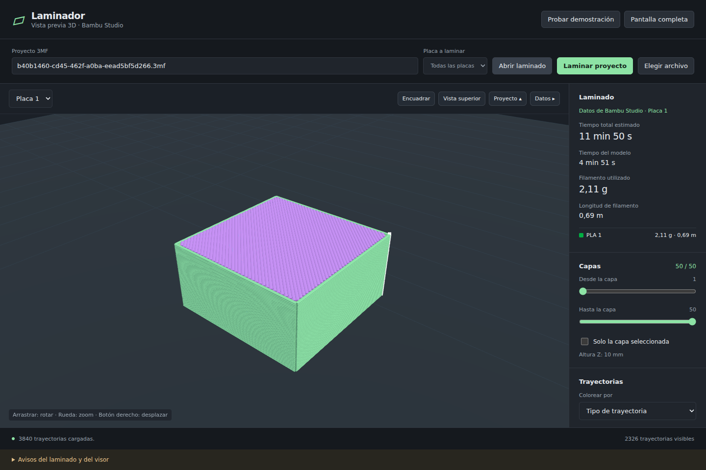
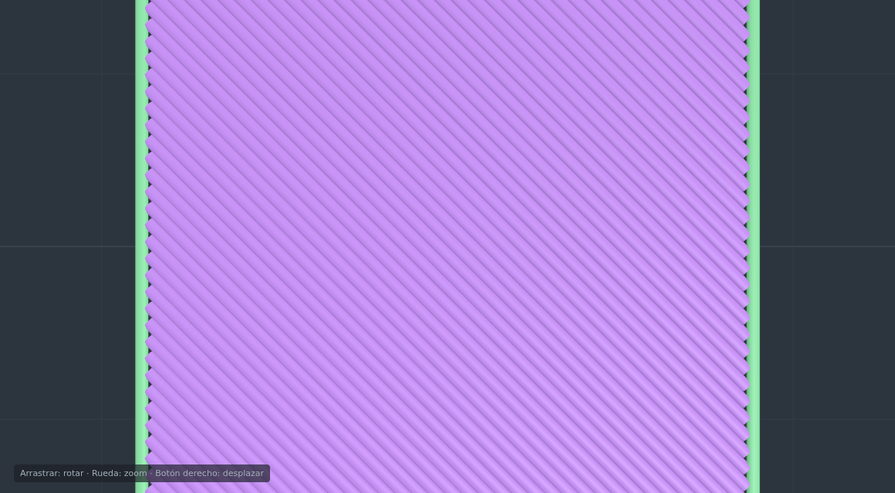
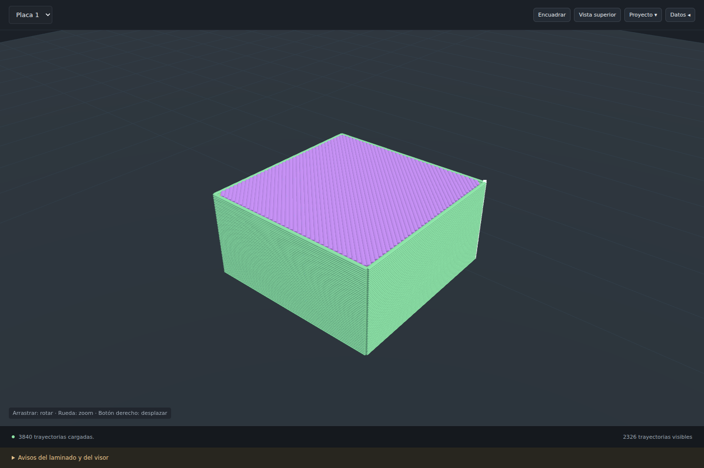

# Laminador Bambu para ChatGPT

[](LICENSE)

Plugin MCP con un visor 3D de trayectorias de impresión. Lamina proyectos 3MF usando Bambu Studio local y muestra capas, extrusión, desplazamientos, tiempos estimados y consumo de filamento. El visor permite rotación, zoom, desplazamiento y selección de capas.

Primera versión de prueba para Windows y Linux. La navegación es una simulación propia; las trayectorias y estadísticas de un laminado real proceden de Bambu Studio.

Los cordones tienen sección redondeada para distinguir líneas adyacentes en superficies horizontales. **Mostrar costuras** marca en blanco los cierres detectados de paredes exteriores y respeta la selección de capas y los filtros. Se infieren de los contornos del G-code: no se garantiza una réplica de costuras scarf ni de la ventana nativa.

La versión **0.1.3** incluye las correcciones de actualización y recuperación del visor, la eliminación de la barra de recorrido y los paneles colapsables. Las capturas y el funcionamiento descrito a continuación corresponden a esta versión; consulta el [estado de verificación](docs/testing.md).



## Explorar el laminado

El modelo aparece completo al terminar la carga, sin animación de reproducción ni barra de recorrido. El visor pide hasta cuatro bloques de 4.000 trayectorias en paralelo y construye la geometría una vez. Esto acelera la vista previa; no cambia el tiempo que necesita Bambu Studio para laminar.

- Arrastra para rotar, usa la rueda para acercar/alejar y el botón derecho para desplazar.
- **Encuadrar** recupera la vista general; **Vista superior** facilita revisar rellenos y paredes.
- Selecciona la placa, el intervalo de capas o **Solo la capa seleccionada**. Se muestran todas las trayectorias del intervalo elegido.
- Colorea por tipo de trayectoria, filamento/herramienta o velocidad. Puedes ocultar tipos, preparación, desplazamientos y costuras.

Para ver líneas paralelas, selecciona la capa superior, activa **Solo la capa seleccionada**, pulsa **Vista superior** y acerca con la rueda. Cada cordón se distingue por su sección redondeada y el sombreado entre líneas, conservando su anchura y posición del G-code.



Los botones **Proyecto ▴/▾** y **Datos ▸/◂**, situados en la barra del visor, permiten plegar y desplegar los paneles independientemente. **Proyecto** oculta la cabecera y los controles del archivo; **Datos** oculta estadísticas y filtros (en móvil, ese panel está debajo del 3D). Los botones quedan visibles para restaurarlos y admiten Enter o Espacio. El estado se mantiene mientras esa página siga abierta; una página nueva comienza con ambos paneles desplegados. Plegarlos conserva el laminado, el zoom, la posición de la cámara y los filtros; el área 3D usa el espacio liberado.



La interfaz ocupa el ancho y alto disponibles. El inspector tiene desplazamiento propio; en ventanas estrechas los controles se organizan debajo del visor. Dentro del plugin, el tamaño máximo lo concede el host. **Ampliar vista** solicita pantalla completa; en el navegador el botón se llama **Pantalla completa**.

Al recibir otro resultado en el mismo visor, se reemplaza la geometría y las estadísticas; las respuestas tardías de trabajos anteriores se descartan. La escena se conserva cuando el navegador guarda temporalmente la página y se redibuja al recuperar visibilidad o restaurar WebGL. Las correcciones se probaron en Chromium y en un iframe MCP; falta repetirlas en el navegador lateral real del usuario.

## Probar el visor ahora

Requiere Node.js **22.12 o posterior**. Desde la carpeta del proyecto:

```bash
npm ci
npm run build
npm start
```

Abre **http://127.0.0.1:4319**. **Probar demostración** muestra un jarrón sintético sin estadísticas inventadas. **Elegir archivo** permite importar `examples/cubo-p2s-laminado.3mf`; pulsa **Abrir laminado** para ver un resultado real incluido, sin instalar Bambu Studio.

El ejemplo tiene 50 capas, 2,11 g, 694,76 mm de filamento, 4 min 51 s del modelo y 11 min 50 s totales. Incluye perfiles P2S y PLA de prueba.

## Laminar tus proyectos

También puedes instalar el motor y el servicio juntos con **Docker en Windows/Linux**, sin instalar Bambu Studio en el host. Consulta [instalación y diagnóstico Docker](docs/docker.md). El instalador genera un marketplace portable separado y mantiene la variante nativa.

Instala Bambu Studio o compílalo desde su [código fuente fijado](docs/engine.md). Configura una **ruta absoluta al ejecutable CLI** y una carpeta de proyectos.

### Windows — PowerShell

```powershell
.\scripts\start.ps1 -BambuStudioPath 'C:\Program Files\Bambu Studio\bambu-studio.exe' -ProjectsDir 'C:\Impresion\Proyectos'
```

La ruta es un ejemplo: usa la de tu instalación. Si tu compilación proporciona `bambu-studio-console.exe`, úsalo. El script instala dependencias npm si faltan y compila el plugin.

### Linux — Bash

```bash
export BAMBU_STUDIO_PATH='/ruta/absoluta/BambuStudio.AppImage'
export PROJECTS_DIR="$HOME/Impresion/Proyectos"
bash scripts/start.sh
```

En Linux sin pantalla gráfica consulta el adaptador Xvfb en [docs/engine.md](docs/engine.md).

En el visor, selecciona el archivo con **Elegir archivo** o escribe una ruta relativa de PROJECTS_DIR. **Laminar proyecto** usa los perfiles incorporados y permite elegir una placa o todas. Consulta el progreso y cancela cuando haga falta. Al terminar se abre el visor y puedes descargar el 3MF laminado.

Los perfiles JSON completos opcionales se pueden proporcionar mediante la herramienta `slice_project` (`machine`, `process`, `filaments`), con rutas relativas a la misma carpeta. No se reemplazan perfiles automáticamente por otros de distinta impresora.

## Dentro de ChatGPT

El visor está empaquetado como **MCP App**. La conexión usa el servidor local y requiere un host compatible y un mecanismo admitido de acceso local/túnel. `localhost` por sí solo no es accesible desde un servicio remoto de ChatGPT.

Sigue [docs/chatgpt.md](docs/chatgpt.md) para instalar el plugin local o conectarlo mediante Secure MCP Tunnel. La entrega incluye `plugin.json`, `mcp.json`, una habilidad y el servidor stdio real. No está instalado en tu ChatGPT ni conectado automáticamente a tu cuenta.

```text
node dist/server.js --stdio
```

La variante HTTP ofrece Streamable HTTP en `http://127.0.0.1:4319/mcp`; solo escucha en el equipo local. No está preparada para exposición pública sin autenticación adicional.

## Herramientas

| Herramienta                           | Función                                             |
| ------------------------------------- | --------------------------------------------------- |
| engine_status                         | Comprueba CLI y configuración del motor             |
| list_projects / inspect_project       | Encuentra e inspecciona proyectos locales           |
| slice_project                         | Inicia laminado y devuelve un trabajo               |
| job_status / cancel_job               | Consulta o cancela el proceso                       |
| open_preview                          | Abre un trabajo terminado o un 3MF laminado         |
| open_demo                             | Prueba el visor con datos sintéticos                |
| get_toolpath_chunk / get_result_chunk | Geometría y descarga por bloques desde la interfaz  |
| begin_import / append_import          | Importación del archivo seleccionado en la interfaz |

## Configuración y conservación de archivos

| Variable            | Valor por defecto                                                          |
| ------------------- | -------------------------------------------------------------------------- |
| BAMBU_STUDIO_PATH   | Sin configurar; se pueden abrir laminados existentes                       |
| PROJECTS_DIR        | `./projects`                                                               |
| JOBS_DIR            | `./.jobs`                                                                  |
| PORT                | `4319`                                                                     |
| HTTP_BIND_HOST      | `127.0.0.1`; `0.0.0.0` solo dentro del contenedor con publicación loopback |
| SLICE_TIMEOUT_MS    | `1800000` (30 minutos)                                                     |
| MAX_CONCURRENT_JOBS | `1`                                                                        |
| MAX_JOBS            | `20` por ejecución del servicio                                            |
| MAX_FILE_BYTES      | `268435456` (256 MiB)                                                      |
| MAX_EXPANDED_BYTES  | `536870912` (512 MiB)                                                      |
| MAX_SEGMENTS        | `2000000` por placa                                                        |

Las rutas de proyectos deben permanecer dentro de la carpeta autorizada. Se rechazan escapes mediante enlaces, ZIP cifrados y archivos que excedan los límites. La importación guarda una copia con nombre UUID dentro de PROJECTS_DIR. Cada laminado conserva una copia de entrada y un resultado en JOBS_DIR; el original permanece intacto.

Los trabajos viven en memoria: al reiniciar, sus identificadores dejan de estar disponibles; los archivos permanecen. Copia los resultados que quieras conservar a PROJECTS_DIR para volver a abrirlos. Limpia JOBS_DIR manualmente con el servicio detenido. Las importaciones incompletas caducan a los 10 minutos al iniciar otra importación; restos de ejecuciones anteriores se pueden limpiar igual. No se eliminan automáticamente los proyectos del usuario.

## Pruebas y empaquetado

```bash
npm run check
npm test
npm run build
npx playwright install chromium
npm run test:ui
npm run package
```

Para incluir el motor real en las pruebas configura BAMBU_STUDIO_PATH antes de `npm test`. Sin esa variable solo se omite la prueba que requiere el binario; la lectura del ejemplo real sigue comprobándose.

[Estado de verificación](docs/testing.md): se probó un laminado real en Linux, el protocolo MCP y el visor en Chromium. Docker/MCP y el parser del plugin se comprobaron en Linux; el informe de instalación Windows está documentado por separado. La compilación C++ completa y la vista embebida real de ChatGPT Desktop siguen pendientes; GitHub Actions verifica el servidor y el visor en Windows y Linux.

Licencia AGPL-3.0-only. Atribuciones y código correspondiente: [THIRD_PARTY.md](THIRD_PARTY.md).

## Contribuciones

Proyecto open source bajo AGPL-3.0-only. Consulta [CONTRIBUTING.md](CONTRIBUTING.md) para desarrollar, informar errores o enviar mejoras. El historial público comienza con una versión inicial de prueba; las limitaciones verificadas están en docs/testing.md.

## GitHub Actions

El workflow [.github/workflows/ci.yml](.github/workflows/ci.yml) se ejecuta en cada push y pull request sobre Windows y Linux con Node.js 22. Comprueba TypeScript, ejecuta las pruebas, compila el servidor y el visor, verifica la interfaz con Chromium y genera un ZIP descargable por sistema. Un job adicional en Linux construye el contenedor, ejecuta la suite con motor real como usuario sin privilegios y comprueba MCP stdio/HTTP y laminado. La integración con el app-server Codex se comprueba con el diagnóstico local opcional; la vista embebida real de ChatGPT Desktop sigue requiriendo prueba en ese host.
